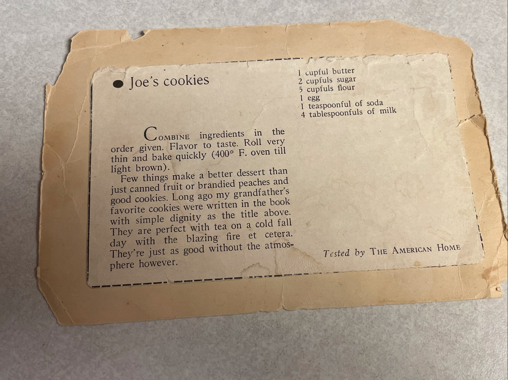

The recipe doesn’t really say
to add vanilla but I put in about 1 1/2 tsp of real vanilla. There aren’t many ingredients so I suggest using the best quality of each.

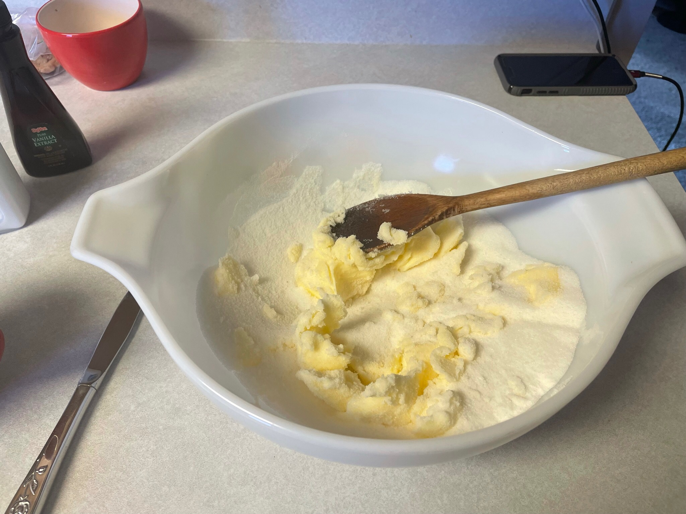
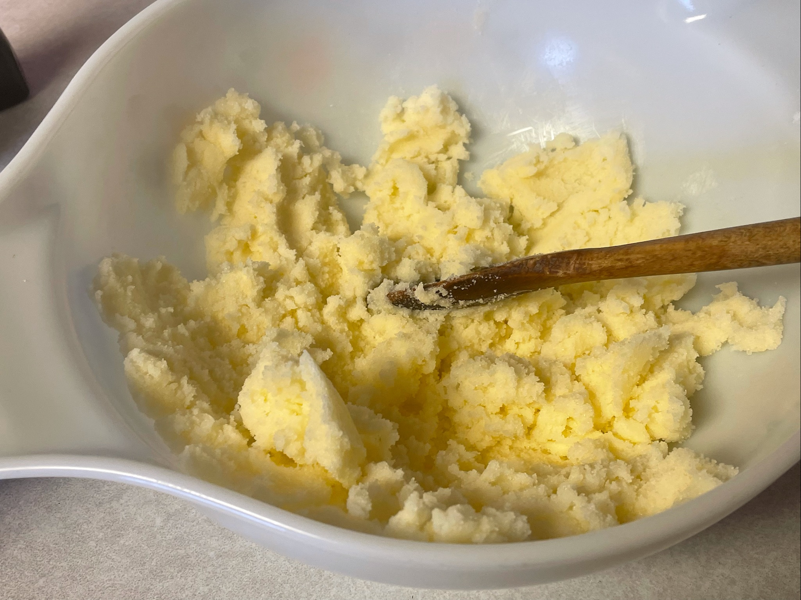

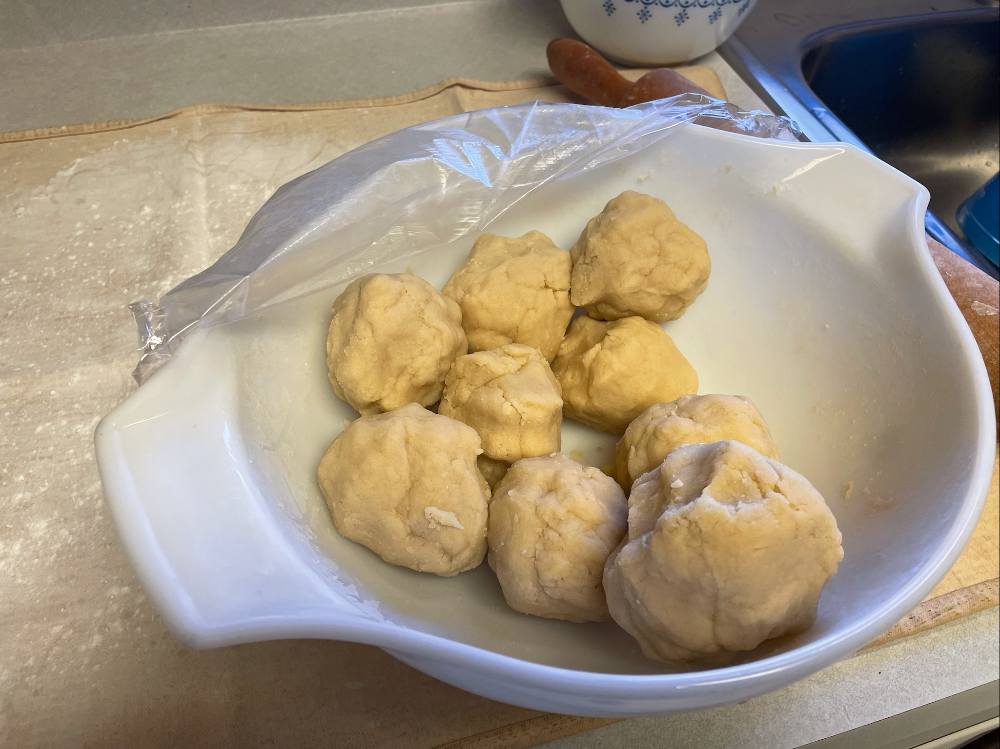

There is a picture of balls of dough after I mixed it. They are too big make them about half the size I did. 

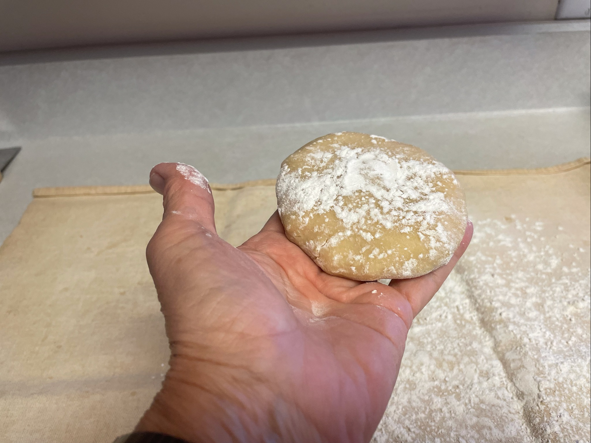
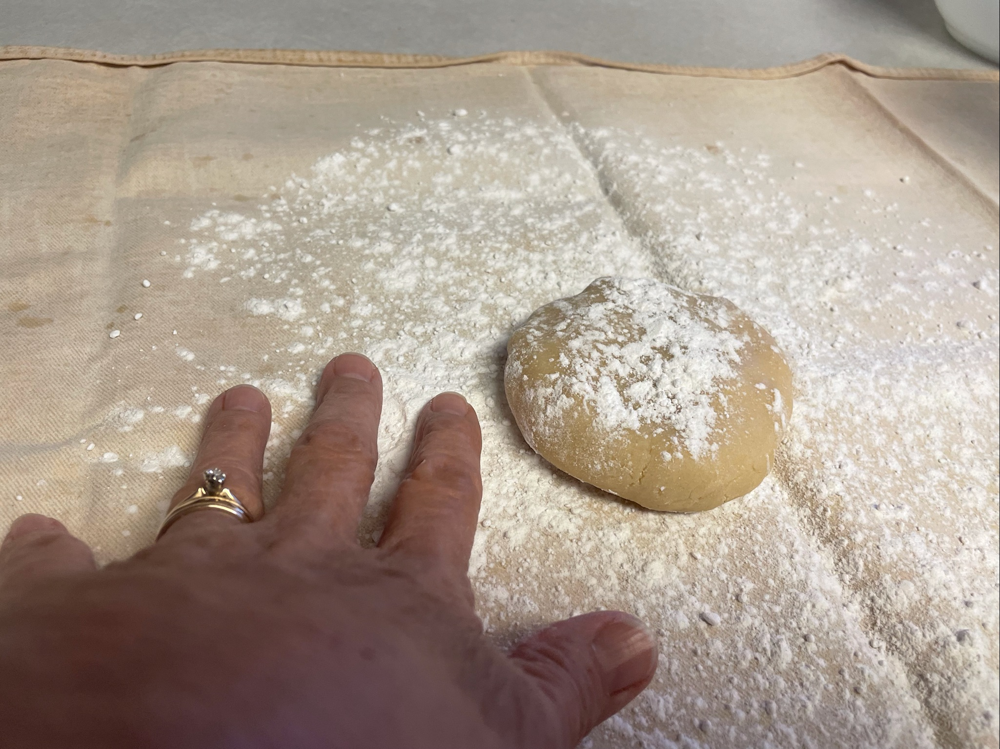

The one in my hand is the correct size. 

I make a mixture of half flour and half powdered sugar to dust the dough with. 

I always use a pastry cloth to roll the dough on. Keep adding flour/ pd sugar liberally. Roll very thin. 

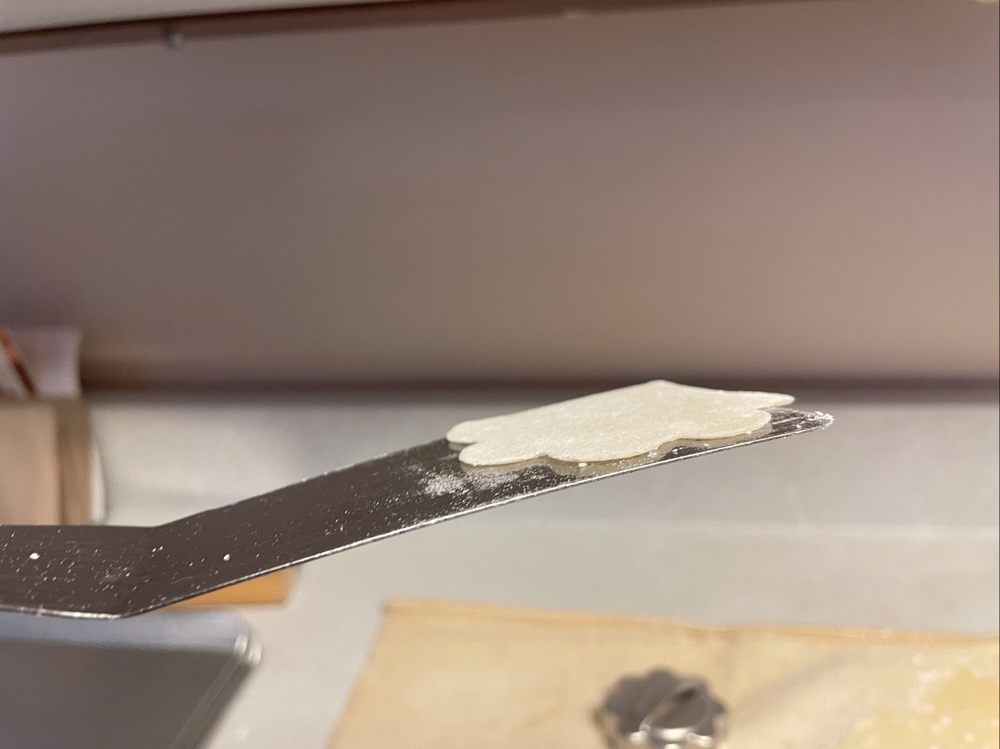

The cookie on the spatula shows the thickness. If you aren’t sure on the thickness then bake a pan full and see how they turn out. I use five cookie sheets so that the pans are cool when you put the cookies on the pan. It is better to clean the pans after two baking too. I will usually fill all five and then bake them. They only take 4-5 minutes per pan. I keep the spatula edge clean too. It makes taking them off the pans easier. Do not let the cookies cool all the way on the pan, or you will have to chip them off the pan.

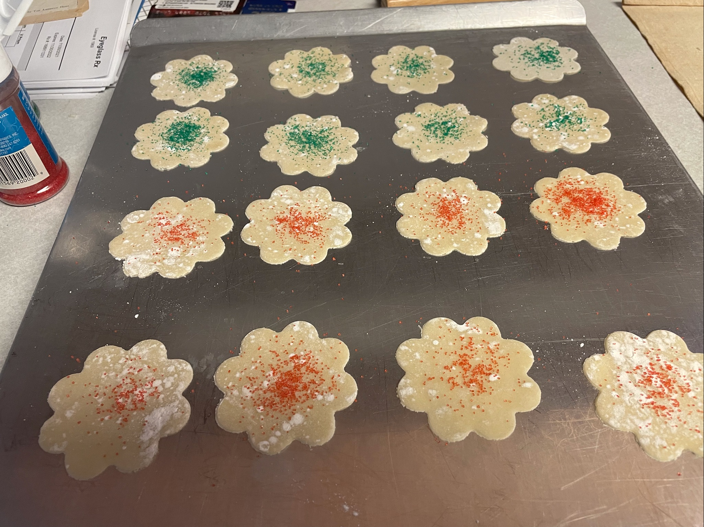
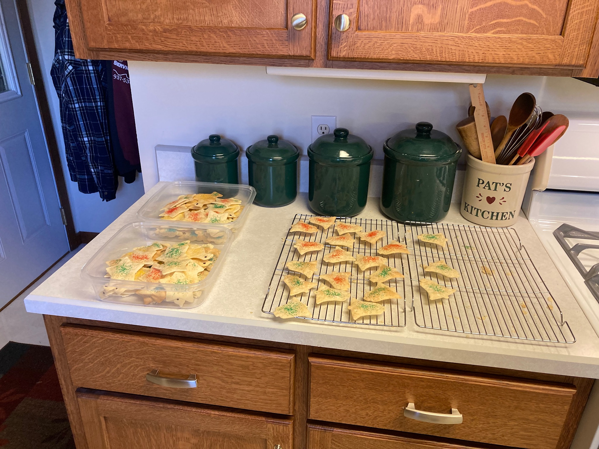

Colored sugar is the only decoration needed. The chickens are an exception. I have no idea why chickens but they are essential. The feet of the chicken needs to be green, as if they are standing in grass, the body is yellow sugar and one chocolate sprinkle for an eye.

If some get a little brown I save them for me. I like them, I think the butter browns in them and I like the taste.

I use air bake cookie pans.

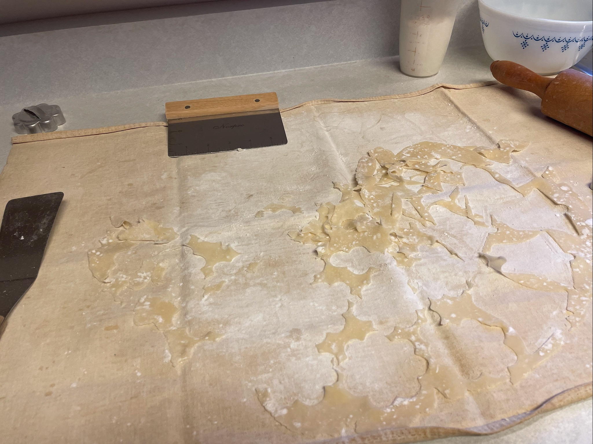
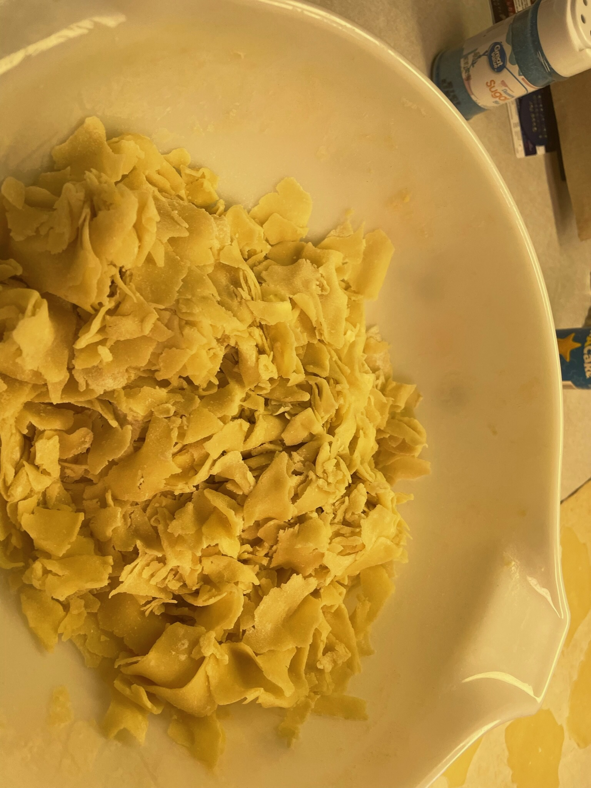

I save the trimmings in a bowl and once I have rolled all of the dough the first time I crumble the trimmings and add a little milk. Then I roll them again. I only do two times.

These stay good for a long time in a can. 